### Juni 2022
# FullStack Projekt: MissMangaBookFace
## Projektuppgift *Carin Wood, Christoffer Knaving, Samantha Theerawat, Ursula Vallejo Janne*
### Content Innehåller:

- [1. General Projektplan](#1-general-projektplan-)
- [2. Personas](#2-personas-)
- [3. Wireframes](#3-wireframes-mobiler-tablets-och-desktop-)
        - [UI och UX](#ui-och-ux)
- [4. Fonts](#4-fonts-)
- [5. Färgschema](#5-frgschema-)
- [6. Projektgenomförande](#3-projektgenomfrande-)
  - [ Funcionen i projekten ](#funcionen-i-projekten)
  - [ Tester](#tester)
  - [ Nya koncept ](#nya-koncept)
  - [ Svårigheter ](#svrigheter)
  - [ Konklusionen](#konklusionen)


# 1. General Projektplan :


I FullStack projektet består av flera delar, generera en backend med koppling med MONGO_DB och därifrån utveckla innehållet i en version av BookFace i REACT.

En del av projektet är att ha en projektutvecklingsplan vars beståndsdelar är nedbrutna i Trello.

Du kan se projektplan i länken nedan:

[Trello Webbsida ](https://trello.com/invite/b/e33HvTu4/a377d7edde9fe517ee789e0362e7a304/bookface)

Varje fil har en README där du kan se de olika paketen som installerades. Här är en sammanfattning:

## Installera följande npm paket i varan projekt:

```shell
BACKEND:
   npm init --y
   npm install 
   npm install cors express dotenv
   npm install -D nodemon
   Middlewares:
   npm install helmet morgan
   Tests:
   npm install -D mocha chai chai-http
   
FRONTEND:
   npx create-react-app client --template typescript
   npm install axios
   npm install react-router-dom@6
   npm i @types/react-router-dom
   npm install react-icons
   npm install tachyons@4.12.0
   
```
# 2. Personas :

För att utveckla projektet har vi beslutat att specificera en typ av användare som vårt förslag av BookFace.
Vi har haft idé att segmentera det till kvinnor mellan 15 och 30 år. Som har en gemensam smak som är mangaserier / comic. 
Ett exklusivt utrymme för dem där de bara får vänner, därför utesluter vi pojkar så att det inte finns något dejtingsätt.

För att utveckla projektet beaktas potentiella användares profiler. Vi har skapat personas om möjliga användare:

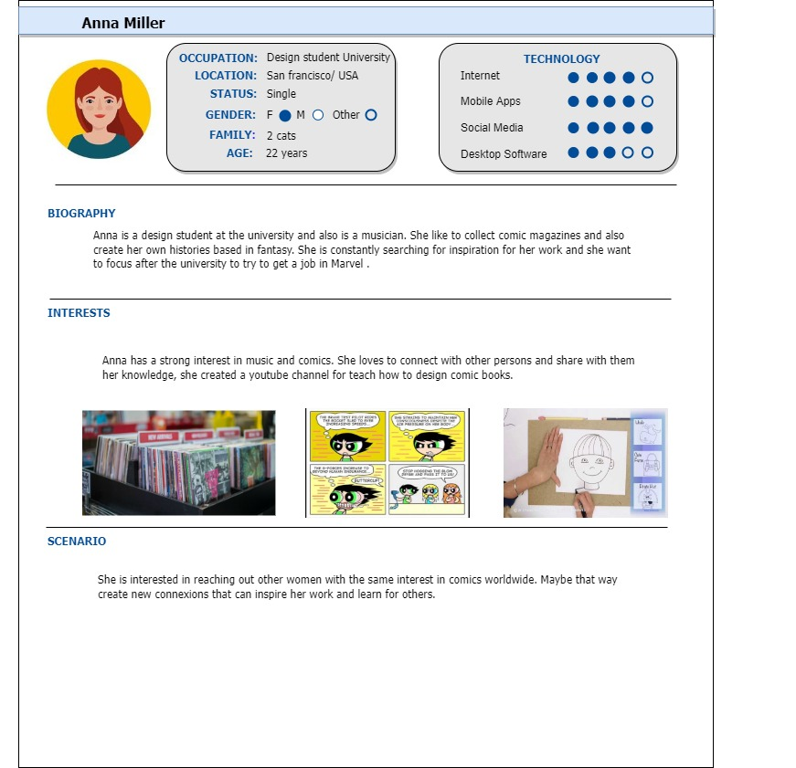

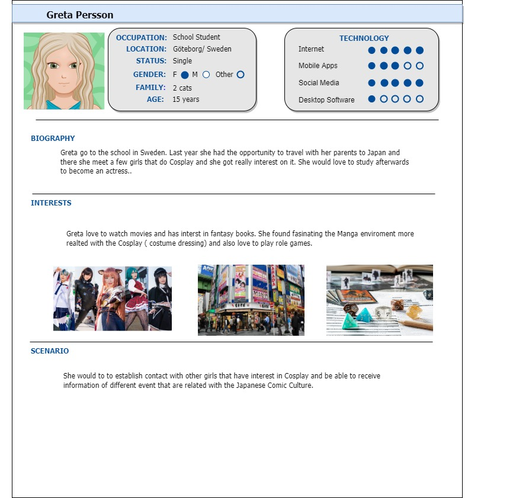

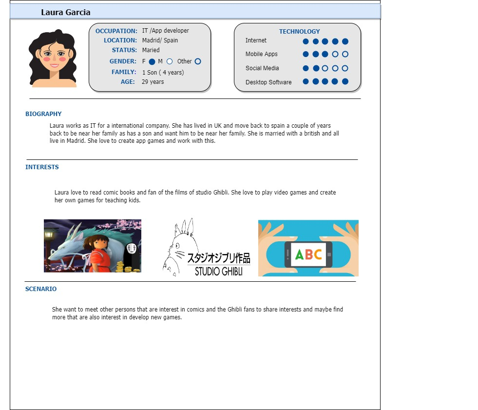


# 3. Wireframes (mobiler, tablets och desktop) :

Utvecklingen av Wireframes för projektet utvecklades i Figma. Där kan du hitta den segmenterade informationen för varje sida och de allmänna element som har implementerats i projektet. 
För detta vi inbjuder dig att se utvecklingen av detta i följande länk:

[PROTOTYP FIGMA PROJECT ](https://www.figma.com/file/wA043HDhQpEwBM8DhTxEy7/Miss-Manga-Bookface?node-id=802%3A7804)


[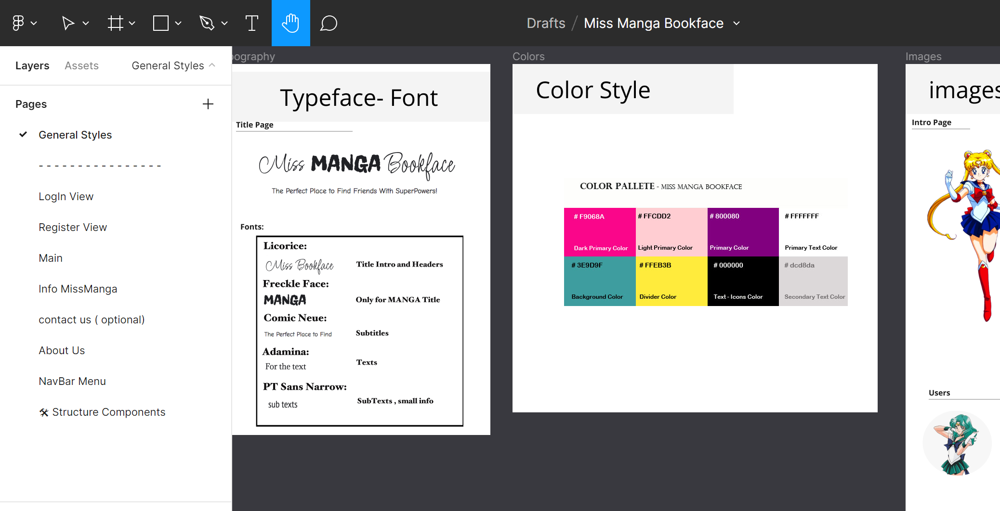](./imgDoku/figmaGeneral.png)

[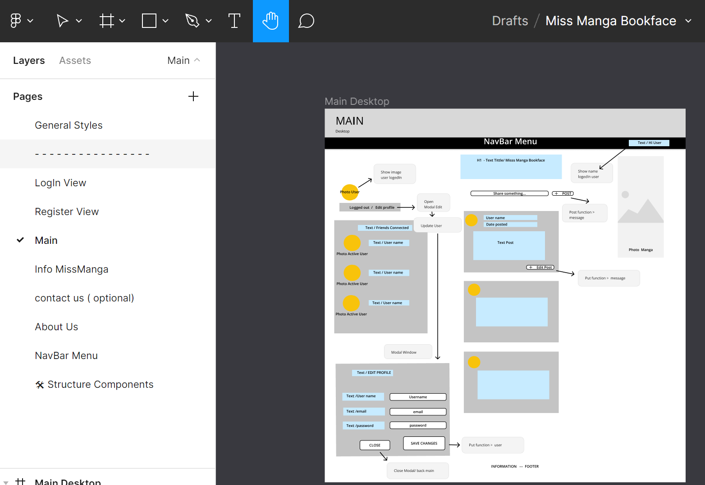](./imgDoku/figma1.png)


### UI och UX:

För att utveckla mitt UI/UX baserar på informationen från Personas och inspirerad i Sailor Moon program.

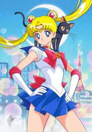

- När man går in på den aktuella hemsidan finns det ingen hänvisning till logotypen, så fort man kommer in på webben finns den på en sida utan betydelse då jag bestämde mig för att prioritera den nya designen så att de som besöker webben kommer ihåg att de är de som hanterar den plattformen. Planera att göra en Hero där logotypen (som ändrar färg från grå till svart för mer vikt visuellt) har en visuell läsprioritet.

- När jag skapade personerna identifierade jag att det finns många användare som behöver ha snabb tillgång till alternativen för att köpa fiskekortet eller möjligheten att göra en swish, för vilket jag valde att ha två knappar på den del av hjälten som är markerade från bakgrunden för att ha dem visuellt och lättillgängliga.


- I menyn på den aktuella sidan som vi ser ovan finns 15 olika alternativ så det är inte lätt att se innehållet. Efter vad vi såg i klassen om informationsarkitektur, grupperade jag dem i 5 huvudalternativ: HEM, NYHETER, OM FISKE, REGLER och MEDLEM.
  Av dessa 5 menyer visar information relaterad till dem för att förbättra användargränssnittet.

Nedan kan vi se undermenyerna:

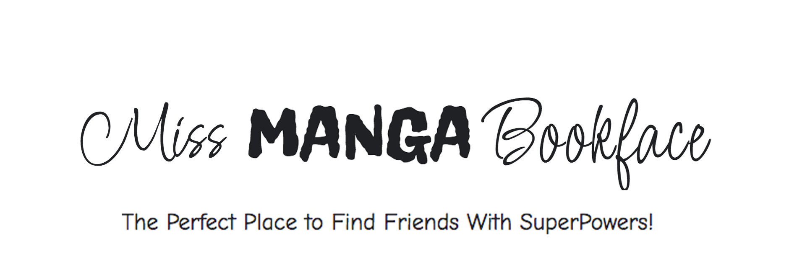

- På huvudsidan anses det vara relevant att ha informationen om Gråbosjöarna då de personer som kommer åt denna sida relaterar till varandra eftersom de ska besöka dessa sjöar för sin motivation och en kort introduktion av var Gråbo ligger och vad det gör Fiskeklubban. Denna aspekt som inte fanns på den tidigare hemsidan och jag anser vara viktig för att försätta användaren i en situation.

- För att få en visuell balans på webbsidan, välj att förena ikonerna för andra plattformar som t.ex. Facebook, instagram eller Swish med färgpaletten som används på webben. Också för att hitta denna visuella förening med bilder mestadels i svartvitt.

- Höjknappar som sticker ut med bakgrundsfärgen där annan information kan nås: från externa sidor eller dropdown Menu ( Button Medlem sida: Contact, styrelse eller Swisha ) med kompletterande information.

- Ha samma layout för Main, där samma struktur föreslås med en sida där de senaste nyheterna finns, ett sökfält och möjlighet att följa dem på sociala medier. Allt detta är samma schema på alla webben.
- Den enda sidan där detta varierar är Medlem där även ett kontaktformulär läggs till.

- I Footer väljer du att sätta informationen om nödtelefonnumret så att det alltid finns till hands och kontakten till fiskeklubben.

# 4. Fonts :

För att utveckla hemsidan valde olika typer av typeface som har en style relaterad med Manga eller skrivstil.

Typeface vi valde var följande:

1. Licorice (title MissManga)
2. Freckle face (title MissManga)
3. Comic Neue (Layout)
4. Adamina (Layout)
5. PT Sans Narrow (Layout)

När mitt urval gjordes efter researchprocessen testade jag dem på webblasaren för att se om de verkligen fungerade bra tillsammans. Vilket du kan se nedan:


##Final Fonts , sizes and color:

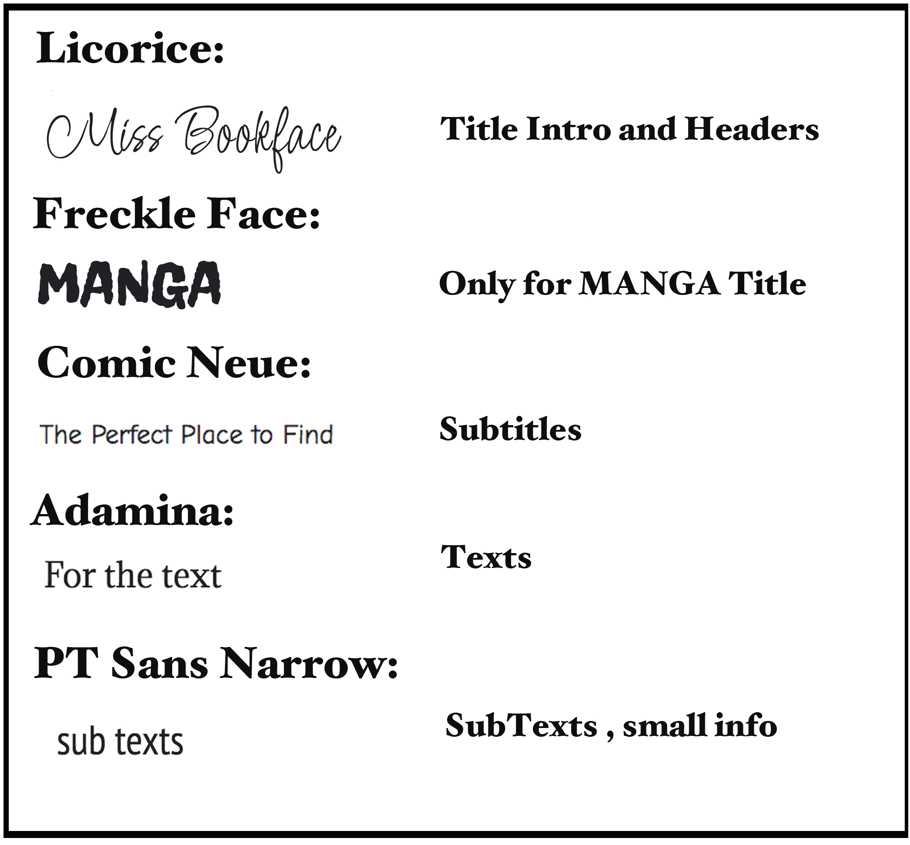

# 5. Färgschema :

Klubben har redan en logotyp som de använde och är nöjda med den. De vill behålla som möjligt vissa färger kan matcha vad de brukar använda: orange, grått, svart och vitt.

Se nedan logotypen de har och någon broschyr de gör för evenemang:


## Color Style:

Jag har tagit idé att klubben är min klient och behöver anpassa sig och försöka tillgodose vad kunden frågar, eftersom de har klart vill behålla samma logotyp.  Under den förutsättningen måste rymma en rad färger som kan fungera med de som de använde (orange och grå).

##Final Color Palette:

!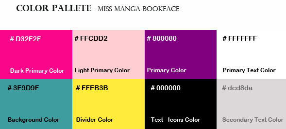

# 6. Projektgenomförande :

Sedan berättar jag processen jag var tvungen att utveckla projektet.

## SCRUM:

## Funktionen i projekten:

Min enkla todo projektet består av endast en sida där funktionerna som finns i backend reflekteras. Dessa är:

- Alive :för att bekräfta om det finns en anslutning till API:et.
  I den nedre delen, lämna den tillgänglig via en ikon för detta leveransprojekt för att kunna verifiera att denna funktion har utförts. I en enda användarversion bör detta inte inkluderas.

### CRUD:

*GET:

- Get Todo Data: tar med sig informationen om befintlig data i arrayen.
- Get User Data by Name : Hitta en användare i arrayen, och returnerar hela objektet.
- Get all users:det finns i backend men använd det inte i frontend eftersom det bara ger namnen och inte användaruppgifterna.

*POST:

- Create Todo: ger möjlighet att skapa en ny användare och en uppgift som tilldelas honom.

*PUT:

- Update User Todo: ger möjlighet att modifiera en befintlig användare i arrayen, ge den ett annat namn och modifiera task.

*DELETE:

_ Delete User: Ta bort en användare med namnet som tar bort allt objekt i arrayen.

För att göra backend-delen följde jag Arasto-handledningen och modifierade den sedan med informationen vi hade i klassen.
När jag skapade mapparna inom MongoDB följde jag Arasto-modellen, så min .env filen i backend skiljer sig från den som implementerats i klassen.

[Tutorial Arasto Node Mongo](https://www.youtube.com/watch?v=-rToCU-vQLM&list=PLo-BJUIALMg_twGJ5IjJIUpXqZH-ULmx0)

## Tester:

I projektet har både frontend och backend testats, vilket vi kan se nedan:

* Backend:

  I Backend-mappen hittar du Insomnia-testfilen.

Test Insomnia:
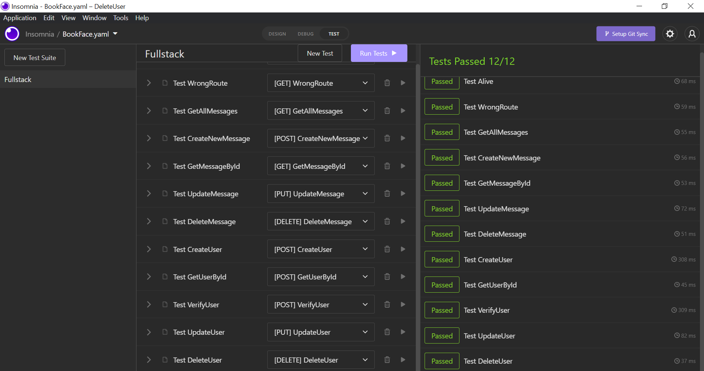

Test backend:

- User:
  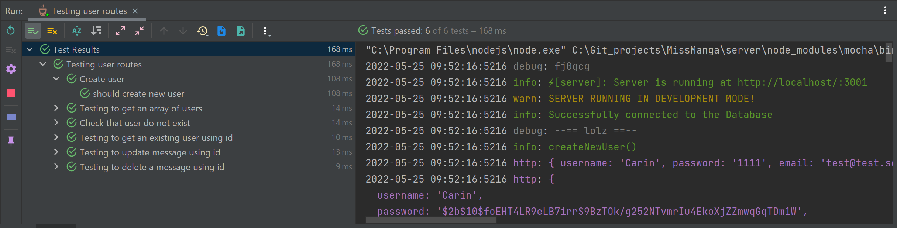

- Messages:
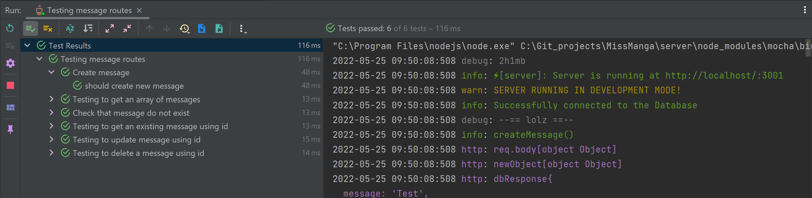

- Comments:
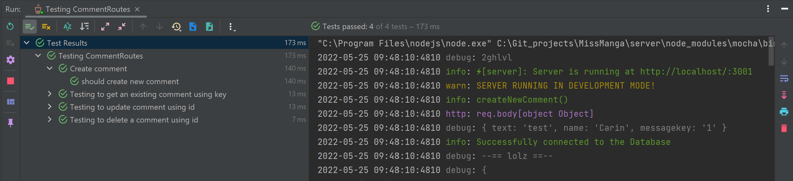

* Frontend:

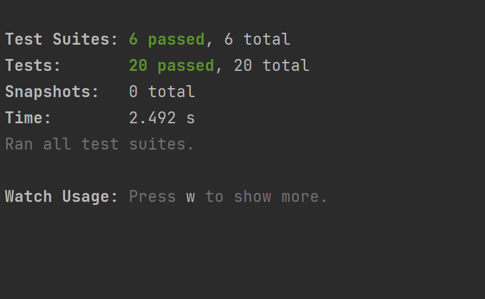


## Nya koncept:

I det här projektet var användningen av Docker och generering av en databas i MongoDB nytt för mig.

Idé att till exempel generera en taskModel som referens och hur man får en koppling till MongoDB är nya koncept som skiljer sig från det tidigare projektet.


## Svårigheter:

1.Den första svårigheten jag hittade var att kunna justera modellen som jag hade följt i Arasto-handledningen så att den skulle fungera med min frontend.
Till exempel, i det tidigare projektet, gjordes delete- och uppdateringsfunktionen med namnet och inte med id. Jag trodde att det skulle vara enkelt att göra den förändringen, men i implementeringen var det inte lätt eftersom det var svårt för mig att förstå hur man anropar informationen från den externa databasen.

2.En annan svårighet som jag har haft och den som har tagit mig mer tid och ansträngning var svårigheten som jag stötte på när funktionerna gav det förväntade resultatet men de skrev inte ut meddelanden som att användaren inte hittades.
För att lösa detta i klassen hjälpte Lars mig att klargöra var informationen kommer ifrån och hur den kommer (vilken typ) för att kunna skriva ut den i min frontend, genom att förstå detta kunde jag förstå hur jag skulle slutföra lösningen.

3. När jag gjorde backend-testerna på task var jag tvungen att ange ett id-nummer varje gång, vilket inte kunde vara svårt vid utvärderingstillfället. I slutet av klassen har de erbjudit oss en idé som hjälpte till att lösa denna svårighet som jag hade när jag skapade en (let userId = '').


## Konklusionen

Övningen att kunna använda en extern databas var väldigt intressant eftersom de i projekt redan i arbetslivet oftast genomförs och jag tycker att det är ett bra verktyg åtminstone för att veta hur det kan genomföras.
Det verkade som en bra utgångspunkt för att förstå relationen med API:t, men jag tror att det hade varit intressant att se hur en mer komplex frontend implementering kunde göras.

Jag hade gärna haft en mer detaljerad förklaring av hur implementeringen gjordes korrekt i frontend-delen och hur den skiljde sig från vad vi implementerade förra gången.
När man gjorde implementeringen den här gången var det många saker som inte fungerade ordentligt och kommunikationen mellan de olika delarna görs olika, varför jag gärna hade sett detta mer på djupet.

Arastos tutorial hjälpte mycket i backend-delen men det hade varit intressant att se hur olika komponenter översätts till typscript.

