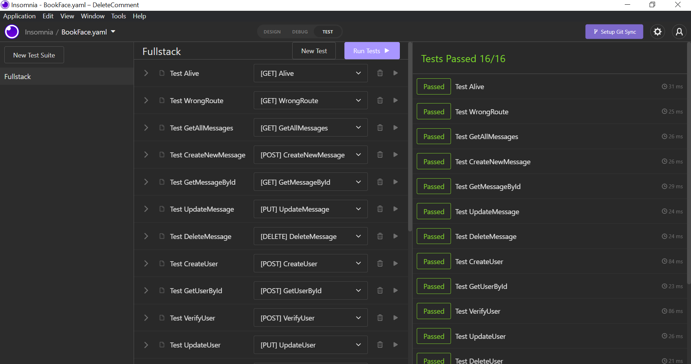

### Juni 2022
# FullStack Projekt: MissMangaBookFace
## Projektuppgift *Carin Wood, Christoffer Knaving, Samantha Theerawat, Ursula Vallejo Janne*
### Content Innehåller:

- [1. General Projektplan](#1-general-projektplan-)
- [2. Personas](#2-personas-)
- [3. Wireframes](#3-wireframes-mobiler-tablets-och-desktop-)
        - [UI och UX](#ui-och-ux)
- [4. Fonts](#4-fonts-)
- [5. Färgschema](#5-frgschema-)
- [6. Projektgenomförande](#3-projektgenomfrande-)
  - [ Funcionen i projekten ](#funcionen-i-projekten)
  - [ Tester](#tester)
  - [ Nya koncept ](#nya-koncept)
  - [ Svårigheter ](#svrigheter)
  - [ Konklusionen](#konklusionen)


# 1. General Projektplan :


I FullStack projektet består av flera delar, generera en backend med koppling med MONGO_DB och därifrån utveckla innehållet i en version av BookFace i REACT.

En del av projektet är att ha en projektutvecklingsplan vars beståndsdelar är nedbrutna i Trello.

Du kan se projektplan i länken nedan:

[Trello Webbsida ](https://trello.com/invite/b/e33HvTu4/a377d7edde9fe517ee789e0362e7a304/bookface)

Varje fil har en README där du kan se de olika paketen som installerades. Här är en sammanfattning:

## Installera följande npm paket i varan projekt:

```shell
BACKEND:
   npm init --y
   npm install 
   npm install cors express dotenv
   npm install -D nodemon
   Middlewares:
   npm install helmet morgan
   Tests:
   npm install -D mocha chai chai-http
   
FRONTEND:
   npx create-react-app client --template typescript
   npm install axios
   npm install react-router-dom@6
   npm i @types/react-router-dom
   npm install react-icons
   npm install tachyons@4.12.0
   
```
# 2. Personas :

För att utveckla projektet har vi beslutat att specificera en typ av användare som vårt förslag av BookFace.
Vi har haft idé att segmentera det till kvinnor mellan 15 och 30 år. Som har en gemensam smak som är mangaserier / comic. 
Ett exklusivt utrymme för dem där de bara får vänner, därför utesluter vi pojkar så att det inte finns något dejtingsätt.

För att utveckla projektet beaktas potentiella användares profiler. Vi har skapat personas om möjliga användare:


# 3. Wireframes (mobiler, tablets och desktop) :

Utvecklingen av Wireframes för projektet utvecklades i Figma. Där kan du hitta den segmenterade informationen för varje sida och de allmänna element som har implementerats i projektet. 
För detta vi inbjuder dig att se utvecklingen av detta i följande länk:

[PROTOTYP FIGMA PROJECT ](https://www.figma.com/file/wA043HDhQpEwBM8DhTxEy7/Miss-Manga-Bookface?node-id=802%3A7804)


[](./imgDoku/figmaGeneral.png)

[](./imgDoku/figma1.png)


### UI och UX:

För att utveckla projekten UI/UX baserar vi på informationen från Personas och inspirerad i Sailor Moon program.


- I rubriken som fungerar som sidans logotyp har vi blandat två typsnitt. En mer feminin (handskriven) och en serie för manga. Således är det konceptuellt kopplat till idén om allmänheten som vi vänder oss till: kvinnor med gemensam smak till den manga-komiska världen.


- Det beslutades i projektet att ha flera sidor som simulerar att vårt projekt är en riktig app, för vilken vi har inkluderat följande sidor:

* Info MissManga:
  Information om konceptet Miss Manga Bookface finns med här. Så det är tydligt för vem som besöker oss för vilken typ av publik vårt projekt riktar sig.

* Contact Us:
  Här finns ett kontaktformulär så att användare kan kontakta företaget.

* About Us:
  I det här avsnittet har vi beslutat att lägga informationen om gruppens medlemmar och vår kontaktinformation så att den kan fungera som en framtida referens och den som besöker den kan veta vem som har utvecklat projektet.

* Main:
 Denna delen kan endast synas om användaren har registrerat sig. Här är väggen där du kan se inläggen och kommentarerna. 
 På samma sätt finns en sektion för att kunna visualisera de användare som är aktiva.

* Logged In page / Register a new user:
  Det är ingångssidan till projektet där du hittar ett formulär för att identifiera dig eller för att registrera dig.

- Hela projektets layout har samma färg och tema för att skapa enhetlighet i innehåll och lika konceptuellt.

- Knapparna för att komma åt formulären och registrera valdes att göras i en kontrasterande färg så att processen som ska följas av användaren skulle vara tydlig.


# 4. Fonts :

För att utveckla hemsidan valde olika typer av typeface som har en style relaterad med Manga eller skrivstil.

Typeface vi valde var följande:

1. Licorice (title MissManga)
2. Freckle face (title MissManga)
3. Comic Neue (Layout)
4. Adamina (Layout)
5. PT Sans Narrow (Layout)

##Final Fonts :


# 5. Färgschema :

För att definiera en färgpalett har vi inspirerats av färgomfånget som används i Sailor Moon. I den dominerar kontrasterande färger med en stor tendens till levande färger. 
Färgen vi använder som bas är en blågrön ton som skapar en kontrast mot de andra elementen.

##Final Color Palette:


# 6. Projektgenomförande :

Sedan berättar vi processen att utveckla projektet.

## SCRUM:

I projektutvecklingsprocessen har vi följt Scrums riktlinjer. För detta har vi segmenterat projektet i delar och distribuerat det mellan oss för dess utveckling.

Vi har satt datum för varje process och vi har haft en daglig kommunikation så att alla medlemmar i gruppen vet i vilket tillstånd av utarbetande vi var, vilka svårigheter vi stötte på och de saker som vi såg längs vägen var platt att utveckla.

I denna process har en av medlemmarna i gruppen fyllt funktionen att samordna gruppen och hjälpa till att fördela arbetet och försöka följa varje utvecklingsstadium noggrant.

## Funktionen i projekten:

I projektet har vi utvecklat tre grundläggande delar i utvecklingen av projektets funktionalitet. 
För detta delar vi konceptuellt in det i tre segment: användare, inlägg och kommentarer.

I dessa tre segment har vi implementerat CRUD : GET, POST, PUT, DELETE; som vi har kontrollerat vid sömnlöshet och motsvarande tester.

## Tester:

I projektet har både frontend och backend testats, vilket vi kan se nedan:

* Backend:

  I Backend-mappen hittar du Insomnia-testfilen.

Test Insomnia:


Test backend:

- User:
  

- Messages:


- Comments:


* Frontend:


## Nya koncept:

I det här projektet var användningen av Docker och generering av en databas i MongoDB nytt för mig.

Idé att till exempel generera en taskModel som referens och hur man får en koppling till MongoDB är nya koncept som skiljer sig från det tidigare projektet.


## Svårigheter:

1.Den första svårigheten jag hittade var att kunna justera modellen som jag hade följt i Arasto-handledningen så att den skulle fungera med min frontend.
Till exempel, i det tidigare projektet, gjordes delete- och uppdateringsfunktionen med namnet och inte med id. Jag trodde att det skulle vara enkelt att göra den förändringen, men i implementeringen var det inte lätt eftersom det var svårt för mig att förstå hur man anropar informationen från den externa databasen.

2.En annan svårighet som jag har haft och den som har tagit mig mer tid och ansträngning var svårigheten som jag stötte på när funktionerna gav det förväntade resultatet men de skrev inte ut meddelanden som att användaren inte hittades.
För att lösa detta i klassen hjälpte Lars mig att klargöra var informationen kommer ifrån och hur den kommer (vilken typ) för att kunna skriva ut den i min frontend, genom att förstå detta kunde jag förstå hur jag skulle slutföra lösningen.

3. När jag gjorde backend-testerna på task var jag tvungen att ange ett id-nummer varje gång, vilket inte kunde vara svårt vid utvärderingstillfället. I slutet av klassen har de erbjudit oss en idé som hjälpte till att lösa denna svårighet som jag hade när jag skapade en (let userId = '').


## Konklusionen

Övningen att kunna använda en extern databas var väldigt intressant eftersom de i projekt redan i arbetslivet oftast genomförs och jag tycker att det är ett bra verktyg åtminstone för att veta hur det kan genomföras.
Det verkade som en bra utgångspunkt för att förstå relationen med API:t, men jag tror att det hade varit intressant att se hur en mer komplex frontend implementering kunde göras.

Jag hade gärna haft en mer detaljerad förklaring av hur implementeringen gjordes korrekt i frontend-delen och hur den skiljde sig från vad vi implementerade förra gången.
När man gjorde implementeringen den här gången var det många saker som inte fungerade ordentligt och kommunikationen mellan de olika delarna görs olika, varför jag gärna hade sett detta mer på djupet.

Arastos tutorial hjälpte mycket i backend-delen men det hade varit intressant att se hur olika komponenter översätts till typscript.

