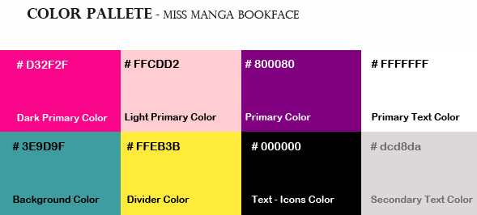

### Juni 2022
# FullStack Projekt: MissMangaBookFace
## Projektuppgift *Ursula Vallejo*

##Projekt

Projektet föreslås göras i grupp och omsätta vår kunskap om Fullstack i praktiken en BookFace Projekt.
Tanken är att genomföra en databas till en backend med tillhörande API som vi kopplar till frontend med react ( tester på : client och server). Detta ska göras med hjälp av Docker, Node.js, MongoDB, Mongoose och React.js med Typescript

En viktig del av projektet har också varit implementeringen av de projekt genomförandekoncept som används i SCRUM.
I det här avsnittet har vi valt att en i gruppen ska ta på sig rollen att samordna de uppgifter som ska utföras och övervaka varje steg i projektet.
Jag har haft denna roll för att kunna hjälpa till att hantera de olika aspekterna av projektet på ett tydligt och effektivt sätt och för att kunna ha en bra koordination och kommunikation med teamet.

##Projektplanering:

För detta bryter vi ner alla krav som har ställts på oss och utvärderar vad vi behövde utveckla för att ha en tydlig vision om det arbete som ska göras.
Vi har gjorts det i Trello och här kommer länken: 

[Trello Webbsida ](https://trello.com/invite/b/e33HvTu4/a377d7edde9fe517ee789e0362e7a304/bookface)


## UX/UI

UX/UI-utvecklingssektionen har varit i min ledning, med feedback från arbetet med gruppen.

-För att utveckla projektet, skapa först en användargrupp som vi ska styra Bookface-projektet till. Så vi har valt kvinnor mellan 15 och 30 år.

-Skapande av användarprofiler: 3 personer som kan ses i den allmänna dokumentationen av projektet.

-Definiera inspirationen vi använder i projektet som vi förlitar oss på Sailor Moon som är Manga (japansk teckningskonst, är full av glada färger och uttryck). Mer detaljerad förklaring finns i gruppdokumentationen.

[](./imgDoku/sailormoonTheme.png)

-Definiera namnet som ska användas för MissManga Bookface och definiera logotypen som vi skulle implementera.

[](./imgDoku/title1.png)
[](./imgDoku/title2.png)

Det här var vad vi definierade att använda:

[](./imgDoku/TitleIntro.jpg)

- Gör en sökning på vilken typ av olika typer av Typeface som skulle kunna gå enligt projektet och gör en tabell över de Typeface som vi skulle implementera (diagram med photoshop och ladda ner dem och lägg till dem i projektet).

[](./imgDoku/fontTest.png)

- Skapa en färgpalett för projektet med kontrasterande och levande färger baserade på Sailor moon-temat.

[](./imgDoku/colorpalette.jpg)

-Med hjälp av Photoshop skapa ett första koncept av hur projektet skulle se ut:
[](./imgDoku/intropage.jpg)

-Skapa i Figma wireframes för projektet och de allmänna aspekterna att ta hänsyn till i utvecklingen av projektet som kan ses i följande länk:

[PROTOTYP FIGMA PROJECT ](https://www.figma.com/file/wA043HDhQpEwBM8DhTxEy7/Miss-Manga-Bookface?node-id=802%3A7804)

I de wireframes som jag har gjort i figma beskrivs aspekter som vilken typ av länkar som finns mellan knapparna och innehållet, samt vilka funktioner som måste skapas i backend.
CRUD-bas för de 3 grupperna som vi måste skapa: användare, meddelanden och kommentarer.
Även visualisering på olika plattformar som desktop, ipad och telefon.

[](./imgDoku/figmaView.png)


##Beskriv lite olika lösningar du gjort:

```javascript

{user === item.name && <p className='delete-comment' onClick={() => deleteComment(item._id)}><FaRegTrashAlt className='trashcan'/></p>}
{user === item.name && <p className='edit-comment' onClick={() => openEditField(item._id, item.text)}><FaRegEdit className='trashcan'/></p>}

```

Har med hjälp av Lars skapat en funktion som verifierar användaren på backend. Den jämför lösenordet med det som hashades och om sant, skicka tillbaka true till frontend.

##Beskriv något som var besvärligt att få till:
Att få till en funktion som gör så man kan ändra från active: false till active: true och skicka det till frontend för att kunna lägga alla active: true i en array så man kan se vilka som är inloggade samtidigt.

##Beskriv om du fått byta lösning och varför i sådana fall:
Jag försökte att kolla på ToggleTaskDone från förra inlämningen för att kunna lösa active: false till active: true och det tog mig ett tag och en lunch innan jag förstod vad som saknades i funktionen.

##Beskriv hur du felsökt ditt program när det uppstått problem:
Med hjälp av console.log() och logger då jag nästan uteslutande jobbat i backend.. Det har krävts en hel del felsökningar för att vad jag får för svar från backend.
Dessutom valde jag att ha med en logger i backend för att enklare se svaret från backend.

##Vad gick bra:
Jag skulle egentligen vilja säga allting men det är mest för att jag har jobbat med det jag känner mig mest bekväm med, dvs backend. Några funktioner krånglade men dessa beskriver jag längre upp.

##Vad gick dåligt:
Egentligen ingenting förutom de funktionerna jag beskrev längre upp.

##Vad har du lärt dig:
Att jag är bra på backendbiten. Jag har även lärt mig om hur Typescript fungerar i backend. Att verifiera en user med att hashat lösenord!

##Vilka möjligheter ser du med de kunskaper du fått under kursen:
Att bygga en backend och databas med hjälp av MongoDB och Mongoose. Jag ser att man med denna kunskapen kan bygga en enklare blogg och att skapa users och messages och comments. Att kunna verifiera en användare på backend så inte vem som helst kan komma in på bloggen. Jag ser ju att detta skulle kunna vara en liten "FaceBook" och att man för att få den till Facebooks storlek måste skala upp men grunden finns där.

##Motivera varför du valt en specifik lösning:
Jag har valt att lägga alla testerna tillsammans i en enda lång rad i Insomnia för att på så sätt hålla nere antalet filer det annars hade blivit.

##Lämna förslag på förbättringar av din kod:
Valde att skapa en egen models för comments då det blev lättare att snabbt få det att funka. Man hade kunnat lägga det i Messages på något sätt men då båda sätten fungerar valde jag detta.

##Lämna exempel på kod du valde att inte implementera:
Tråkigt svar men jag har använt all kod jag såg framför mig när vi fick inlämningen. Då jag verkligen bara ville jobba med backend visste jag redan vad för kod jag tänkte använda. Annars är det väl det med comments att jag skapade en egen models som jag kunde gjort annorlunda.

##Lämna förslag på förbättringar av din UI/UX design eller reflektera över den:
Jag har helt valt att jobba med backend och lämnat UI/UX till dom som verkligen kan det här med design i min grupp. Detta av en enkel anledning, jag hade aldrig kunnat göra det lika snyggt som dom andra gjort!

##Egna tankar:
Kul att få fortsätta med backend då jag verkligen fastnat för den delen. Och som jag skrev tidigare så är detta en bra grund för en site som typ facebook även om denna är mycket mindre såklart. Sen var det både kul och jobbigt att jobba tillsammans i grupp. Projektet är såpass litet att det blir jobbigt då det är ganska få filer som ska skapas och byggas. Jag fattar att det blir såhär på ett företag men det tar lite tid att vänja sig då vi bara jobbat enskilt fram till nu.